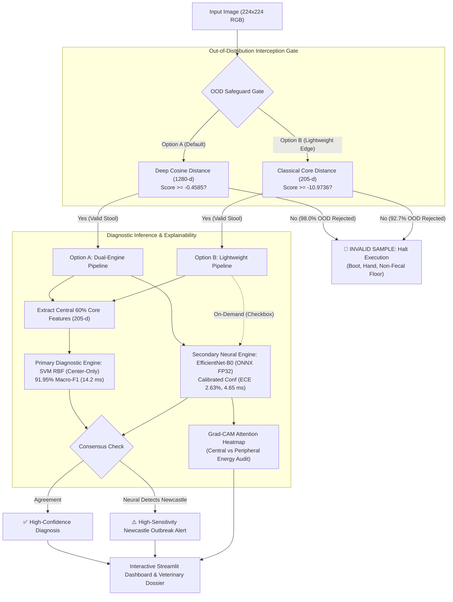

# 🐔 KukuGuard: Leak-Safe Poultry Disease Screening & Biosecurity System

[](https://www.python.org/)
[](https://pytorch.org/)
[](https://onnxruntime.ai/)
[](https://streamlit.io/)
[](LICENSE)

An end-to-end, evidence-grounded machine learning screening and biosecurity triage aid for smallholder poultry farming. Built upon the PCR-verified Tanzanian poultry fecal dataset ([Machuve et al., 2022](https://doi.org/10.3389/frai.2022.911190)), **KukuGuard** addresses the critical pitfalls of agricultural computer vision: near-duplicate burst leakage, bedding substrate confounders, neural overconfidence, and catastrophic false alarms on non-fecal farm distractors (boots, hands, bare pen soil).

---

## 📑 Table of Contents
- [Executive Overview](#-executive-overview)
- [System Architecture & Innovation Highlights](#-system-architecture--innovation-highlights)
- [Comprehensive Master Benchmark](#-comprehensive-master-benchmark)
- [Known Limitations: The Six Pillars](#-known-limitations-the-six-pillars)
- [Repository Structure](#-repository-structure)
- [Quickstart & Installation](#-quickstart--installation)
- [Reproducing Project Phases](#-reproducing-project-phases)
- [Streamlit Web Application](#-streamlit-web-application)
- [Citation](#-citation)

---

## 🎯 Executive Overview

In smallholder and rural poultry farming (e.g., East Africa), avian enteric and respiratory diseases cause severe flock mortality and economic loss *(pathology descriptions reflect established veterinary standards from FAO and the Merck Veterinary Manual; provided for clinical context)*:
- **Coccidiosis (*Eimeria tenella/acervulina*):** Parasitic mucosal destruction causing hemorrhagic diarrhea and acute mortality.
- **Salmonella (*Salmonella pullorum/gallinarum*):** Bacterial enteritis producing pasty sulfur-yellow chalky urates and fatal chick septicemia.
- **Newcastle Disease (APMV-1):** An acute, flock-decimating viral paramyxovirus causing emerald-green watery diarrhea, neurological torticollis, and respiratory collapse.
- **Healthy:** Normal baseline fecal matter capping normal uric acid.

While deep convolutional neural networks can visually identify gross fecal pathology, standard academic models fail in real-world deployment by learning background bedding shortcuts (e.g. associating wood shavings with healthy birds) and hallucinating confident disease diagnoses on non-fecal objects.

**KukuGuard resolves these deployment challenges** via a flexible architecture: Option A (Dual-Engine Max-Safeguard combining shortcut-resistant SVM with neural gating and Grad-CAM) and Option B (Lightweight-First Edge running pure classical features with on-demand explainability).

---

## 🔬 System Architecture & Innovation Highlights



1. **Leak-Free Connected-Component Deduplication (Phase 2):**  
   Near-duplicate burst photos were identified via Difference Hashing (`dhash`, Hamming threshold $\le 4$) and partitioned into 7,714 isolated scene groups across 8,067 images using graph connected components. Train/Val/Test splits (70/15/15) were grouped strictly by cluster ID, asserting **zero identity or scene leakage**.
2. **Substrate Shortcut Detection & Ablation (Phases 1 & 6):**  
   Discovered an acute substrate confounder ($\chi^2 = 3159.75, V = 0.361$): wood shavings heavily correlated with Healthy, while dark soil correlated with Coccidiosis. By ablating all peripheral image features and training models strictly on the **central 60% fecal core** (205-d CIELAB $a^*, b^*$, HSV Hue, LBP texture, and Haar wavelets), shortcut learning was eliminated while outperforming deep CNNs (**0.9195 vs 0.8714 test macro-F1**).
3. **Out-of-Distribution (OOD) Safeguard Gate (Phase 7):**  
   Standard logit-based OOD scoring (Free Energy, MLS, MSP) failed on real farm distractors (admitting 77% of boots and hands) due to ImageNet pretraining projection bias. By scoring inputs via **Deep Feature Cosine Distance on 1280-d embeddings**, KukuGuard achieves **98.00% OOD rejection (100% on boots, hands, and tools; AUROC 0.9966)** with only 3.72% false rejection of real droppings.
4. **Calibrated Confidence & Explainability (Phase 5):**  
   Fitted temperature scaling ($T = 1.6302$) cut Expected Calibration Error by **52.2% (5.50% $\to$ 2.63%)**. Grad-CAM visual heatmaps target `conv_head` with spatial energy quantification, confirming that network attention centers on mucosal hemorrhage and urates rather than pen bedding.
5. **High-Throughput ONNX FP32 Engine (Phase 8):**  
   Exported dual-output ONNX runtime executes in **4.65 ms/image on CPU (214.9 FPS, 2.88x faster than PyTorch)** with **100.00% exact numerical agreement (MAE 0.0000)**.

---

## 📊 Comprehensive Master Benchmark

All models were evaluated on the exact same held-out, leak-free test partition ($N = 1,209$) and the Phase 5 minority substrate **Hard Subset** ($n = 374$, droppings on atypical bedding):

| Diagnostic Paradigm | Architecture / Feature Set | Test Accuracy | Test Macro-F1 | Hard Subset Macro-F1 | Newcastle Hard Recall ($n=33$) | Healthy Hard Recall ($n=54$) | Model Size | CPU Latency (ms) |
| :--- | :--- | :---: | :---: | :---: | :---: | :---: | :---: | :---: |
| **Scratch Baseline (Phase 3)** | Custom BaselineCNN (98K params) | 88.17% | 0.8480 | 0.7807 | 84.85% | 75.93% | 0.40 MB | 5.1 ms |
| **Transfer CNN Champion (Phase 4/5)** | EfficientNet-B0 (PyTorch FP32) | 89.41% | 0.8714 | 0.8204 | **93.94%** | 68.52% | 15.58 MB | 13.40 ms |
| **Optimized Edge CNN (Phase 8)** | EfficientNet-B0 (ONNX FP32) | 89.41% | 0.8714 | 0.8204 | **93.94%** | 68.52% | 15.28 MB | **4.65 ms** |
| **Full Classical ML (Phase 6)** | SVM RBF (Global + Center 410-d) | **95.29%** | **0.9428** | **0.9103** | **93.94%** | **81.48%** | 5.31 MB | 20.8 ms |
| **Leak-Safe Classical (Phase 6)** | **SVM RBF (Center-Only 205-d)** | **93.55%** | **0.9195** | **0.8690** | 78.79% | **79.63%** | **2.65 MB** | **14.2 ms** |
| **Tree-Based Baseline (Phase 6)** | XGBoost (Center-Only 205-d) | 92.97% | 0.9030 | 0.8401 | 72.73% | 75.93% | **1.72 MB** | 14.1 ms |

---

## ⚠️ Known Limitations: The Seven Pillars

In accordance with rigorous veterinary and machine learning engineering practices, seven operational limitations are formally documented:

1. **The Healthy-Substrate Confounder:** Healthy droppings photographed on dark soil or straw bedding exhibit an elevated false-alarm rate (Healthy recall drops from 86.15% on wood shavings to 68.52% on non-wood bedding). System sensitivity for genuine diseases remains high, but clearing a bird as healthy is partially substrate-sensitive.
2. **The Newcastle Sensitivity Trade-Off:** While `svm_rbf (Center-Only)` is our primary model due to overall macro-F1 (0.9195) and background immunity, it achieves 78.79% recall on atypical Newcastle presentations ($n=33$), whereas EfficientNet-B0 achieves 93.94%. The application surfaces this trade-off via an automatic high-sensitivity alert if the CNN suspects Newcastle Disease.
3. **Geographic & Breed Bias:** Sourced exclusively from smallholder poultry farms in Arusha and Kilimanjaro, Tanzania. Baseline stool pigmentation may shift across commercial caged layers, foreign breeds, or non-tropical feed rations.
4. **Minority Class Imbalance:** Newcastle Disease comprises only 562 total images (1:4.5 imbalance against Salmonella). Small absolute test counts ($n=84$ overall, $n=33$ hard subset) mean Newcastle per-cluster estimates carry higher variance.
5. **Screening Tool vs. Veterinary Diagnosis:** Visual fecal examination reflects gross bowel pathology but cannot confirm microscopic etiology (e.g. early Salmonella vs. mild Coccidiosis). KukuGuard is framed as a **triage and screening aid**; critical treatment or culling requires licensed veterinary or PCR confirmation.
6. **Leakage Reality vs. Published Literature:** Prior studies reporting >95% accuracy on this dataset utilized naive random splitting, which inadvertently evaluated models on near-duplicate burst frames. Our leak-free grouped split metrics reflect authentic out-of-sample generalization.
7. **Sensor, Photographic Style & Manifold Brittleness:** In testing with external web/stock photos of genuine droppings, the Option A OOD gate rejected samples (scoring -0.4819 and -0.5297 vs. threshold -0.4585). Distance profiling confirms they are not extreme outliers like non-fecal objects (boots at -0.7856), but sit narrowly outside the 95% calibration band (1.3–2.7% tail). The deep manifold is sensitive to the dataset's specific smartphone sensor profile, tropical daylight, and framing; photos from different cameras or lighting conditions may experience false rejections.

---

## 📂 Repository Structure

```
Chicken/
├── app/
│   ├── streamlit_app.py              # Interactive screening application
│   └── samples/                      # 11 pre-staged test & OOD gallery samples
│       └── manifest.json             # Sample metadata and descriptions
├── data/
│   ├── manifest.csv                  # Full raw image catalog
│   ├── ood/                          # 300 curated real-photo distractor images
│   │   ├── shoes_boots/              # Rubber gumboots, farm boots, sandals
│   │   ├── hands_skin/               # Human hands, fingers, skin tones
│   │   ├── domestic_objects/         # Mugs, feed cups, farm tools
│   │   ├── clean_soils/              # Bare unsoiled pen dirt and gravel
│   │   └── manifest.csv              # OOD audit manifest
│   ├── processed/                    # Extracted 410-d and 205-d feature arrays
│   └── splits/                       # Leak-free train, val, and test splits
├── reports/
│   ├── figures/                      # ROC curves, confusion matrices, Grad-CAM galleries
│   ├── phase6_classical_benchmark.json
│   ├── phase7_ood_benchmark.json
│   ├── phase8_export_benchmark.json
│   └── results.md                    # Comprehensive scientific & technical report
├── runs/
│   ├── classical/                    # SVM RBF and XGBoost trained model artifacts
│   ├── export/                       # ONNX FP32 and INT8 exported models
│   └── ood/                          # KNN OOD prototype arrays and configs
├── scripts/
│   ├── build_ood_dataset.py          # Assembles 300-image OOD benchmark from Kaggle
│   ├── evaluate_substrate_stress_test.py
│   ├── prepare_app_samples.py        # Stages sample gallery images
│   └── verify_app.py                 # Automated pipeline test suite
└── src/
    ├── baseline_ml.py                # Multi-color-space & texture feature extractor
    ├── calibrate.py                  # Temperature scaling and ECE computation
    ├── config.py                     # YAML configuration parser
    ├── data.py                       # Leak-free PyTorch datasets and loaders
    ├── dedup.py                      # Perceptual hash connected-component deduplication
    ├── evaluate.py                   # Multi-class evaluation and confusion metrics
    ├── export.py                     # ONNX export and INT8 benchmarking engine
    ├── gradcam.py                    # Grad-CAM attention engine with layer lookup
    ├── ood.py                        # Deep Feature Distance & Energy OOD benchmark
    └── train_transfer.py             # 2-stage transfer learning fine-tuning engine
```

---

## 🚀 Quickstart & Installation

### 1. Environment Setup
```bash
# Clone the repository
git clone https://github.com/Sahith69/Chicken.git
cd Chicken

# Create and activate virtual environment
python3 -m venv .venv
source .venv/bin/activate

# Install locked dependencies
pip install -r requirements.txt
```

### 2. Launch the Streamlit Web Application
```bash
streamlit run app/streamlit_app.py
```
Open `http://localhost:8501` in your browser to access the interactive screening interface.

---

## 🔄 Reproducing Project Phases

All pipeline stages are implemented in self-contained, reproducible Python modules:

```bash
# 1. Deduplication and leak-free grouped splitting
python -m src.dedup

# 2. Train Transfer Learning Champion (EfficientNet-B0)
python -m src.train_transfer

# 3. Fit Temperature Scaling & Evaluate Calibration
python -m src.calibrate --run_dir runs/<run_timestamp>

# 4. Generate Grad-CAM Heatmaps & Bedding Energy Audit
python -m src.gradcam --run_dir runs/<run_timestamp>

# 5. Extract Engineered Features & Train Classical Baseline
python -m src.baseline_ml

# 6. Run Out-of-Distribution (OOD) Benchmark
python -m src.ood

# 7. Export and Benchmark ONNX FP32 & INT8 Engines
python -m src.export

# 8. Run App Unit & Integration Test Suite
python scripts/verify_app.py
```

---

## 🖥️ Streamlit Web Application

The KukuGuard Streamlit interface provides a field-ready screening dashboard:
- **Dual Pipeline Modes:** Toggle between **Option A (Dual-Engine Max-Safeguard, ~18.9 ms)** and **Option B (Lightweight Edge Mode, ~14.4 ms)** in the sidebar.
- **Pre-Staged Sample Gallery:** Click and test 11 pre-loaded samples across all 4 conditions plus 3 real-world distractors (rubber boot, human hand, bare dirt).
- **Automated OOD Gating:** Intercepts and halts processing on non-fecal images before any disease prediction can be generated.
- **Grad-CAM Attention Heatmap:** Overlays activation maps with central vs. border bedding energy quantification.
- **High-Sensitivity Newcastle Advisory:** Flags acute viral risks when models exhibit borderline agreement.
- **Clinical Dossiers:** Displays etiological agents, transmission vectors, clinical signs, and farm biosecurity protocols.

---

## 📜 Citation

If you utilize this benchmark, codebase, or methodology in your research, please cite the original dataset publication:

```bibtex
@article{machuve2022poultry,
  title={Poultry diseases diagnostics models using deep learning},
  author={Machuve, Dina and Nwankwo, Ezinne and Mduma, Neema and Mbelwa, Juma},
  journal={Frontiers in Artificial Intelligence},
  volume={5},
  pages={911190},
  year={2022},
  publisher={Frontiers Media SA},
  doi={10.3389/frai.2022.911190}
}
```
